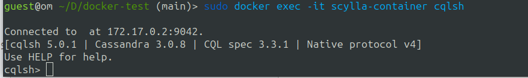

## Pull the ScyllaDB image

```
sudo docker pull scylladb/scylla
```

## Create a Docker Volume

```python
docker volume create scylla_data
```
## Run the ScyllaDB Docker Container with the Volume:

```python
docker run -d --name my_scylla_container -v scylla_data:/var/lib/scylla -p 9042:9042 scylladb/scylla
```

**Notes:** ScyllaDB's data will be stored on the `scylla_data` Docker volume, ensuring data persistence even if you stop and start the container. 

## Run the ScyllaDB Docker Container

```python
sudo docker run --name scylla-container -d scylladb/scylla
```
## Or With port mapping
```python
sudo docker run -d --name scylla-container -p 9042:9042 scylladb/scylla
```

## Run cqlsh

```python
sudo docker exec -it scylla-container cqlsh
```





## Run container bash 

```python
sudo docker exec -it scylla-container bash
```


[Ref](https://chat.openai.com/share/ce2c68bb-54c2-4fb5-b910-f9c985fca1ab)


## ScyllaDB CRUD operation

## Create KeySpace in ScyllaDB 

```python
CREATE KEYSPACE <KeySpace_name> WITH replication = {
    'class': 'SimpleStrategy',
    'replication_factor': 1
};
```

## Use keyspace 

```python
use <KeySpace_name>;
```

## Create Table 

```python
CREATE TABLE items ( 
   id uuid PRIMARY KEY,
   name text, 
   completed boolean
);
```
## Insert data

```python
INSERT INTO items (id, name, completed) VALUES (uuid(), 'Todo 1', false);
```
## Show table data

```python
 SELECT *FROM items;
```

## Update table data

```python
UPDATE items  SET completed = true WHERE id = 3699e2ae-a28c-45a3-ae9a;
```

## Delete table data

```python
DELETE FROM todos.items WHERE id = 3699e2ae-a28c-45a3-ae9a;
```

**Screenshort**

